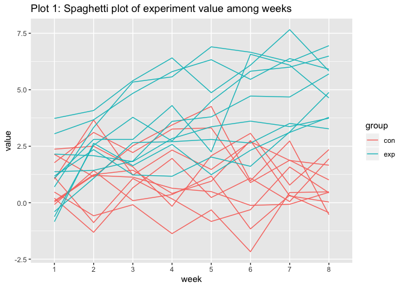
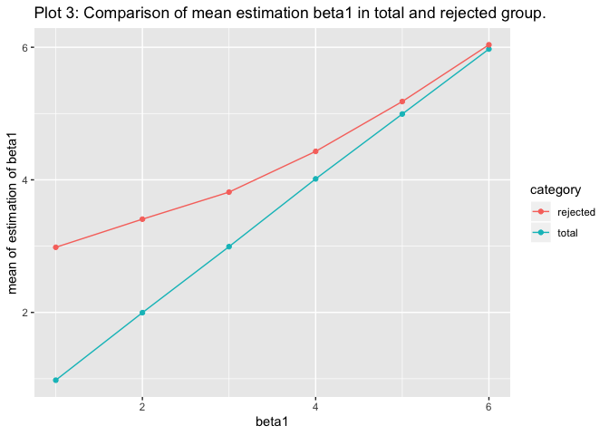

p8105\_hw4\_ym2771
================
Yuqi Miao
11/2/2019

# Problem 1

``` r
library(tidyverse)

set.seed(10)

iris_with_missing = iris %>% 
  map_df(~replace(.x, sample(1:150, 20), NA)) %>%
  mutate(Species = as.character(Species))
```

``` r
fill_missing <- function(vec){
    if (is.character(vec[1])) {
        vec = ifelse(is.na(vec), "virginica",vec)
    }else{
        if (is.numeric(vec)) {
            mean = round(mean(vec,na.rm = T), 2)
            vec = ifelse(is.na(vec), mean,vec)
        }else{
            vec = vec
        }
    }
        
}

iris_fill_NA <- map(iris_with_missing,fill_missing) %>% bind_cols()
iris_fill_NA    
```

    ## # A tibble: 150 x 5
    ##    Sepal.Length Sepal.Width Petal.Length Petal.Width Species
    ##           <dbl>       <dbl>        <dbl>       <dbl> <chr>  
    ##  1         5.1          3.5         1.4         0.2  setosa 
    ##  2         4.9          3           1.4         0.2  setosa 
    ##  3         4.7          3.2         1.3         0.2  setosa 
    ##  4         4.6          3.1         1.5         1.19 setosa 
    ##  5         5            3.6         1.4         0.2  setosa 
    ##  6         5.4          3.9         1.7         0.4  setosa 
    ##  7         5.82         3.4         1.4         0.3  setosa 
    ##  8         5            3.4         1.5         0.2  setosa 
    ##  9         4.4          2.9         1.4         0.2  setosa 
    ## 10         4.9          3.1         3.77        0.1  setosa 
    ## # … with 140 more rows

# Problem 2

``` r
file_names <- paste("data/",list.files("data"),sep = "")
study_df <- 
    map(file_names,read_csv) %>% 
    bind_rows() %>% 
    mutate(group_number = str_sub(file_names,6,11),
           ID = row_number()) %>% 
    pivot_longer(cols = 1:8, names_to = "week",names_prefix = "week_",values_to = "value") %>% 
    separate(col = group_number,c("group","number"),sep = '_') %>% 
    mutate(week = factor(as.numeric(week), levels = 1:8),
           group = factor(group,levels = c("con","exp"))) %>% 
    select(ID,everything(),-number)
```

``` r
study_df %>% 
  ggplot(aes(x = week,y = value,color = group, group = ID))+
  geom_line() +
  labs(title = "Plot 1: Spaghetti plot of experiment value among weeks")
```

<!-- -->

## comment

As shown in plot 1，The value of experiment group increases along time,
but the value of control group is fluctuated in a specific range.

# Problem 3

``` r
sim_reg <- function(beta1 = 0){
    n = 30
    beta0 = 2
    var = 50
    x = rnorm(n)
    y = beta0 + beta1*x + rnorm(n,0,sqrt(var))
    ls_fit = broom::tidy(lm(y~x,))
    ls_fit %>% filter(term == "x") %>% select(estimate,p.value)
    
}

estimationa_beta1_0 <- 
    rerun(10000,sim_reg()) %>% 
    bind_rows()


estimation <- 
    tibble(
        beta1 = 1:6
    ) %>% 
    mutate(out_list = map(.x = beta1, ~rerun(10000,sim_reg(.x))),
           out_df = map(out_list, bind_rows)) %>% 
    select(-out_list) %>% 
    unnest(out_df)
```

``` r
g1 <- estimation %>% 
  filter(p.value<0.05) %>% 
  group_by(beta1) %>% 
  summarise(count = n(),proportion = count/10000) %>% 
  ggplot(aes(x = beta1, y = proportion))+
  geom_bar(stat = "identity")+
  geom_text(aes(y = proportion + 0.05,label = proportion))+
  labs(y = "Proportion of rejection( P-value < 0.05)", title = "Plot 2: Power of different effective size")

g1
```

<!-- -->

## comment

As Shown in Plot 2, the power is increasing as the effective size
increase(defined as the difference as the null and alternative
hypothesis of beta1 value).

The proportion of rejection when beta1 = 0 is the significance level of
the hypothesis.

``` r
mean_total = estimation %>% 
  group_by(beta1) %>% 
  summarise(mean = mean(estimate)) %>% 
  mutate(category = "total")

mean_reject = estimation %>% 
  filter(p.value <= 0.05) %>% 
  group_by(beta1) %>% 
  summarise(mean = mean(estimate)) %>% 
  mutate(category = "rejected")

g2 <- rbind(mean_total,mean_reject) %>% 
  ggplot(aes(x = beta1, y = mean, color = category)) +
  geom_point() +
  geom_line()+
  labs(y =  "mean of estimation of beta1", title = "Plot 3: Comparison of mean estimation beta1 in total and rejected group.")
g2
```

<!-- -->

## comment

As shown in plot 3, total means of estimation of different beta1 are
approximately equal to true parameter, since we simulated 10,000 times
with fairly large sample size, but the means of estimation which are
rejected of different beta1 are gradually approching to true parameter
as the effective size increases.

When effective size is close to 0, it is hard to reject the null
hypothesis unless the estimation value falls in extremely situation
(tails of true distribution), and estimation in extremly large situation
is more likely to be generated and rejected, thus the proportion of
rejection is small (as shown in plot 2) and the mean value is larger
than the true parameter.

As the effective size increase, the differences between alternative and
null distributions enlarge, it is more likely to fall in the rejection
region of null hypothesis and the proportion of rejected estimation is
approximate to 1 in large effective size, thus the mean of rejection is
approach to true parameter.
